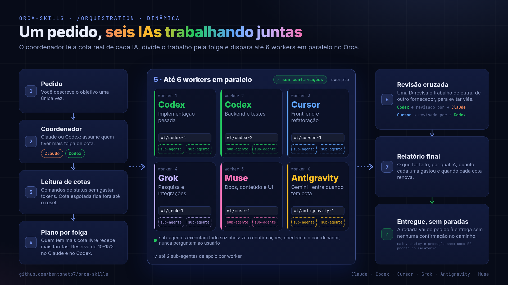
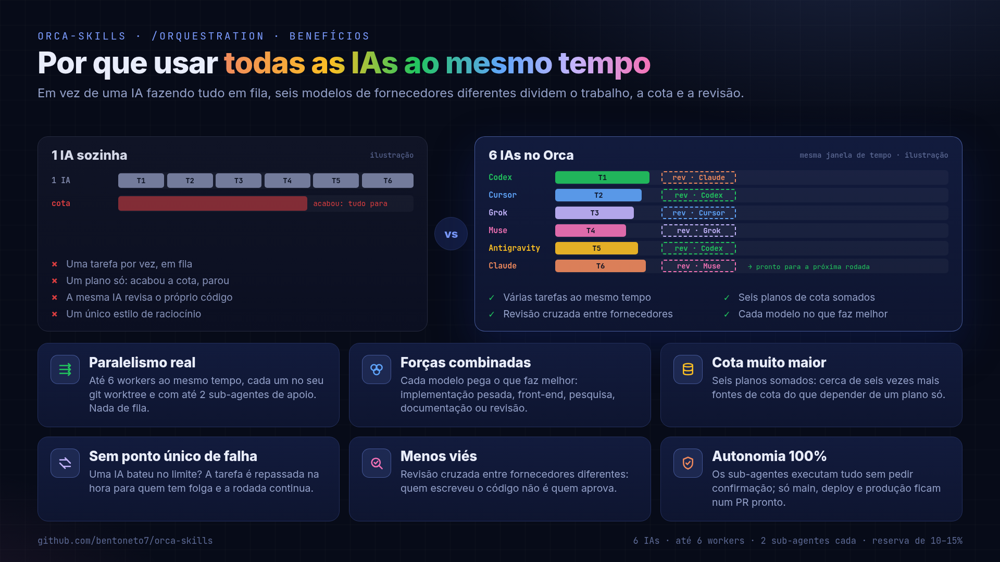
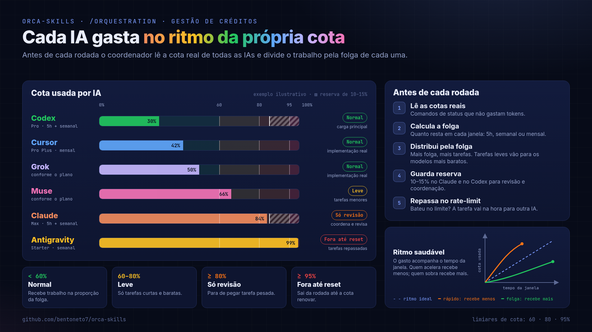
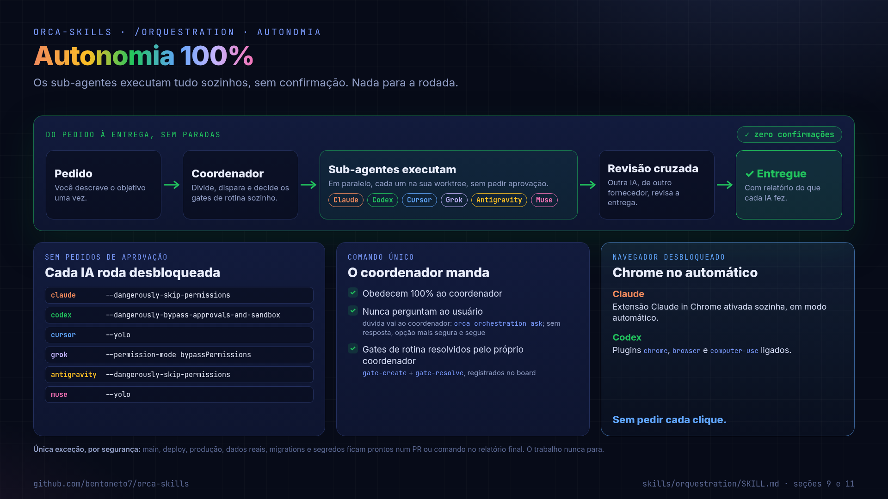
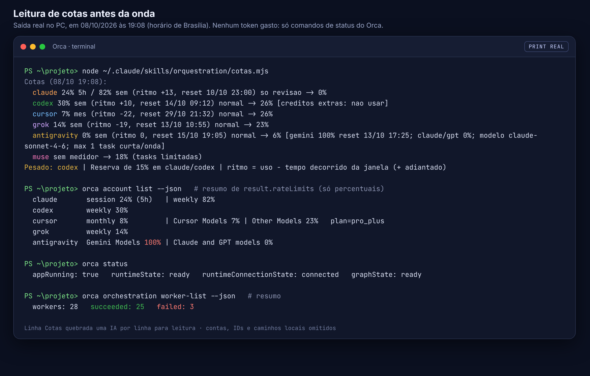

# orca-skills

Equipe de seis IAs trabalhando juntas no [Orca](https://github.com/stablyai/orca), com gestão de créditos: antes de cada onda, a skill lê a cota real de cada IA e dá mais trabalho a quem tem mais folga. **Claude**, **Codex**, **Cursor**, **Grok**, **Antigravity** e **Muse** dividem a tarefa em ondas paralelas, com expansão de subagentes. Qualquer uma pode coordenar ou ser subagente.

**Tutorial completo, do passo 1 até a configuração concluída: [docs/TUTORIAL.md](docs/TUTORIAL.md).**

**Entenda a ideia completa, a dinâmica e por que é mais eficiente: [docs/IDEIA.md](docs/IDEIA.md).**

## Principais benefícios



- **Seis IAs em paralelo.** Claude, Codex, Cursor, Grok, Antigravity e Muse trabalham ao mesmo tempo, cada uma na própria worktree, em ondas com dependências.
- **Revisão cruzada sem viés.** Toda entrega é revisada por uma IA de outro fornecedor, que não sabe quem fez.
- **Gestão de créditos com balanço saudável.** A cota real de cada IA é lida antes de cada onda, sem gastar tokens. Quem tem mais folga recebe mais trabalho, quem está adiantado no consumo da janela recebe menos, e Claude e Codex guardam 15% para revisão crítica.
- **Redistribuição automática.** Se uma IA bate o limite no meio do trabalho, a tarefa passa na hora para a próxima com folga, e a IA sem cota fica de fora até o reset.
- **Autonomia 100%.** Os sub-agentes executam tudo sem pedir confirmação, e Claude e Codex agem no Chrome sozinhos. Só main, deploy e produção ficam num PR pronto no relatório.
- **Economia de tokens.** Respostas de até 15 linhas, handoffs curtos e o modelo mais barato que resolve cada tarefa.
- **Instaladores para macOS, Linux e Windows.** Um comando instala e confere tudo em todas as IAs.





## Autonomia 100%

**Os sub-agentes executam tudo sozinhos, sem confirmação.** Cada IA roda no Orca com os argumentos que dispensam aprovação, obedece 100% ao coordenador e nunca pergunta ao usuário. Os gates de rotina são resolvidos pelo próprio coordenador. O Chrome também está no automático: o Claude usa a extensão Claude in Chrome em modo automático e o Codex tem os plugins `chrome`, `browser` e `computer-use`, então os dois navegam, clicam e testam páginas sem pedir cada clique. Nada para a rodada, do pedido à entrega. Detalhes em [docs/IDEIA.md](docs/IDEIA.md#autonomia-100).



<sub>Única exceção, por segurança: merge na main, deploy, produção, dados reais, migração em banco real e segredos ficam prontos num PR ou comando no relatório final. O trabalho nunca para.</sub>

## Como fica no Orca

Print real do Orca rodando a `/orquestration` (recortado) e a leitura de cotas feita antes de cada onda, sem gastar tokens. Mais prints e o formato do plano e do relatório em [docs/IDEIA.md](docs/IDEIA.md).




## Instalação rápida

Com o Orca e as CLIs já instalados e logados:

**macOS / Linux**

```bash
git clone https://github.com/bentoneto7/orca-skills.git
cd orca-skills
bash scripts/instalar.sh
bash scripts/instalar.sh --verificar
```

**Windows**

```powershell
gh repo clone bentoneto7/orca-skills
cd orca-skills
powershell -ExecutionPolicy Bypass -File .\scripts\instalar.ps1
powershell -ExecutionPolicy Bypass -File .\scripts\instalar.ps1 -Verificar
```

Depois, no Orca: **Settings > Agents > Refresh** e abra uma sessão nova de cada agente.

## O que tem aqui

| Caminho | O que é |
|---|---|
| `skills/orquestration/` | Regras da equipe: gestão de créditos pela cota real, papel de cada IA, board, revisão cruzada entre fornecedores, autonomia com limites fixos e execução em paralelo (até 6 workers). |
| `skills/orquestration/cotas.mjs` | Lê a cota de cada IA (`orca account list --json`, sem gastar tokens) e imprime a linha `Cotas` com uso, ritmo, reset e a parte de cada IA. |
| `skills/orchestration/` | A skill oficial de orquestração do Orca, com a seção "Equipe Zuuuw" no fim, que carrega a `orquestration`. |
| `config/equipe-orca.md` | Regras de como cada IA recebe e responde as chamadas do coordenador. O script grava esse texto nas instruções globais de cada IA. |
| `config/grok-rules-orca-equipe.md` | As mesmas regras no formato do Grok (`~/.grok/rules/`). |
| `config/cursor-rules-orca-equipe.mdc` | As mesmas regras no formato do Cursor (`~/.cursor/rules/`). |
| `config/grok-config.toml.example` | Trecho sugerido para o `~/.grok/config.toml`. |
| `config/orchestration-hook.md` | A seção "Equipe Zuuuw" que o script acrescenta na skill do Orca. |
| `scripts/instalar.sh` | Instala tudo em todas as IAs no macOS/Linux (`--verificar` só confere). |
| `scripts/instalar.ps1` | O mesmo no Windows (`-Verificar` só confere). |

## Uso

Numa sessão do Claude ou do Codex aberta pelo Orca:

```
/orquestration <o que precisa ser feito>
```
