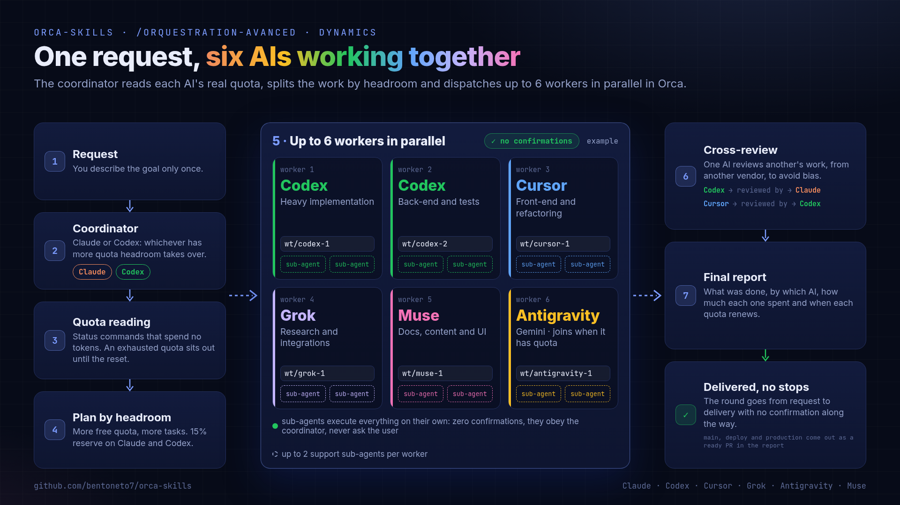
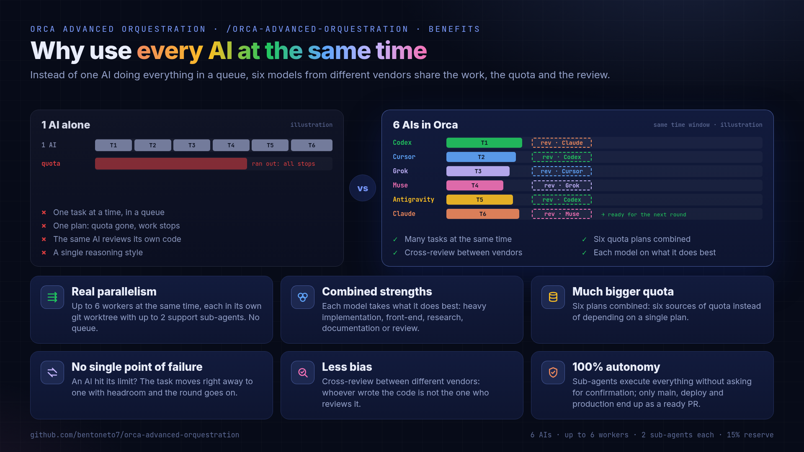
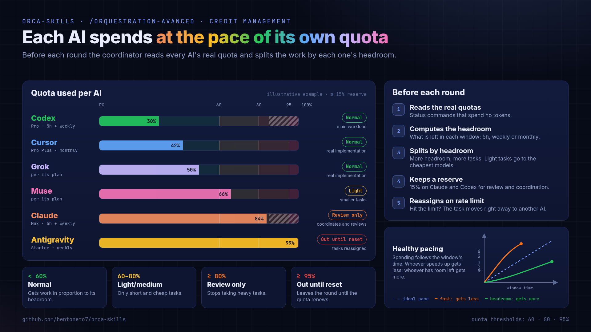
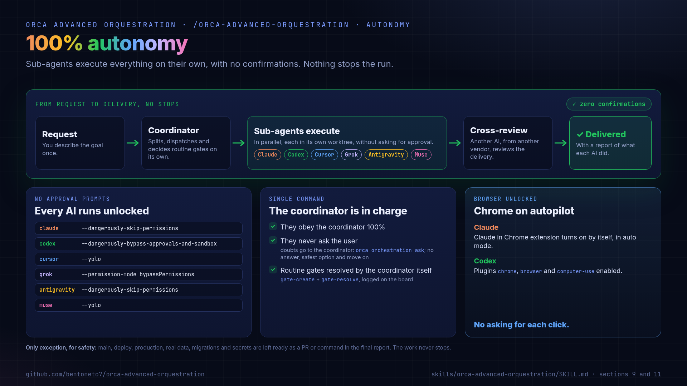
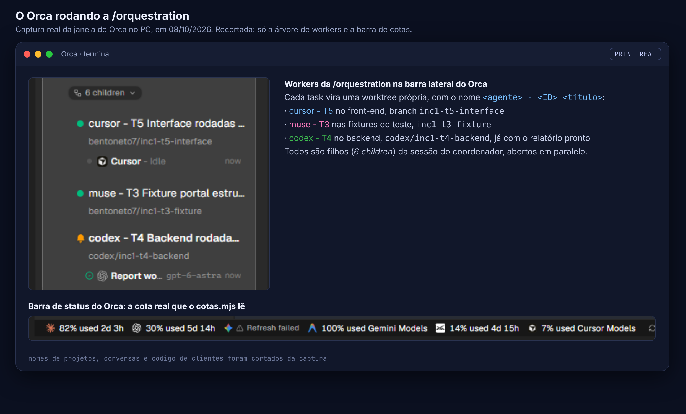
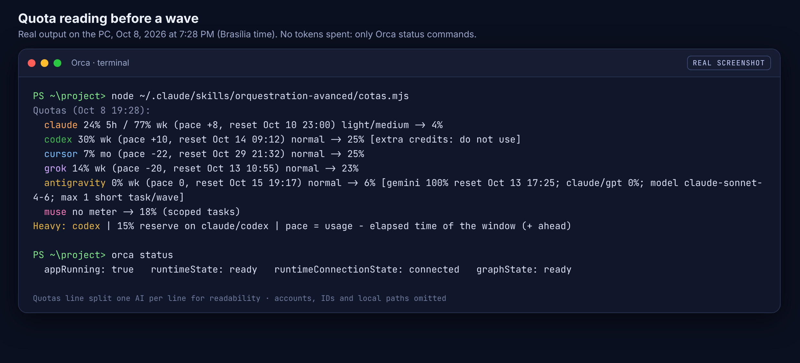

# Orca Skills: multi-agent AI orchestration for Claude Code, Codex, Cursor, Grok, Gemini/Antigravity and Muse

**Run six AI coding agents in parallel in [Orca](https://github.com/stablyai/orca), with real quota and rate-limit balancing and 100% autonomous sub-agents.**

[](https://github.com/bentoneto7/orca-skills/stargazers)
[](docs/TUTORIAL.md)
[](docs/IDEA.md)
[](https://github.com/stablyai/orca)

## What is this

`orca-skills` is a **multi-agent orchestration** setup for **AI coding agents**. One request to the `/orquestration-avanced` skill splits the work across **Claude Code**, **OpenAI Codex CLI**, **Cursor CLI**, **Grok CLI**, **Gemini via the Antigravity CLI** and **Muse**, running as **parallel agents** in separate **git worktrees** inside [Orca](https://github.com/stablyai/orca). Before every wave it reads each agent's real usage with zero-token commands, so the work follows each subscription's **quota and rate limits**: whoever has more headroom gets more work, and an agent that hits its limit is replaced on the spot. Sub-agents run with no confirmation prompts, obey the coordinator and review each other across vendors.



## Contents

- [Main benefits](#main-benefits)
- [Quick start](#quick-start)
- [100% autonomy](#100-autonomy)
- [What it looks like in Orca](#what-it-looks-like-in-orca)
- [FAQ](#faq)
- [What's in here](#whats-in-here)
- [Documentation](#documentation)
- [Contributing](#contributing)

## Main benefits

- **Six AIs in parallel.** Claude, Codex, Cursor, Grok, Antigravity and Muse work at the same time, each in its own worktree, in waves with dependencies.
- **Unbiased cross-review.** Every delivery is reviewed by an AI from another vendor, which does not know who wrote it.
- **Credit management with healthy pacing.** Each AI's real quota is read before every wave, without spending tokens. Whoever has more headroom gets more work, whoever is ahead of its window's pace gets less, and Claude and Codex keep 15% for critical review.
- **Automatic reassignment.** If an AI hits its limit mid-run, the task moves right away to the next one with headroom, and the AI without quota sits out until its reset.
- **100% autonomy.** Sub-agents execute everything without asking for confirmation, and Claude and Codex act in Chrome on their own. Only main, deploy and production end up as a ready PR in the report.
- **Token economy.** Replies of up to 15 lines, short handoffs and the cheapest model that does each task.
- **Installers for macOS, Linux and Windows.** One command installs and checks everything in every AI.





## Quick start

With Orca and the CLIs already installed and logged in (full walkthrough in the [tutorial](docs/TUTORIAL.md)):

**macOS / Linux**

```bash
git clone https://github.com/bentoneto7/orca-skills.git
cd orca-skills
bash scripts/instalar.sh
bash scripts/instalar.sh --verificar
```

**Windows**

```powershell
gh repo clone bentoneto7/orca-skills
cd orca-skills
powershell -ExecutionPolicy Bypass -File .\scripts\instalar.ps1
powershell -ExecutionPolicy Bypass -File .\scripts\instalar.ps1 -Verificar
```

Then, in Orca: **Settings > Agents > Refresh**, set **Settings > Orchestration > Nested worker depth = 2** and open a new Claude or Codex session in your project:

```
/orquestration-avanced <what needs to be done>
```

The installer also removes the old `orquestration` skill folders (the skill was renamed to `orquestration-avanced`).

## 100% autonomy

**Sub-agents execute everything on their own, with no confirmations.** Each AI runs in Orca with the arguments that skip approvals, obeys the coordinator 100% and never asks the user. Routine gates are resolved by the coordinator itself. Chrome runs on autopilot too: Claude uses the Claude in Chrome extension in auto mode and Codex has the `chrome`, `browser` and `computer-use` plugins, so both browse, click and test pages without asking for each click. Nothing stops the run, from request to delivery. Details in [docs/IDEA.md](docs/IDEA.md#100-autonomy).



<sub>Only exception, for safety: merge to main, deploy, production, real data, migrations on a real database and secrets are left ready as a PR or command in the final report. The work never stops.</sub>

## What it looks like in Orca

A real (cropped) screenshot of Orca running the skill, and the quota reading done before each wave, without spending tokens. More screenshots and the plan and report formats in [docs/IDEA.md](docs/IDEA.md).





## FAQ

**How do I run Claude Code and Codex in parallel?**
Install [Orca](https://github.com/stablyai/orca) and this repository's skills, then run `/orquestration-avanced <task>` in a Claude or Codex session. The coordinator creates tasks on Orca's board and starts each worker with `orca orchestration worker-start --worktree new-child`, so every agent works at the same time in its own git worktree, without touching the others' files.

**How do I avoid hitting Claude usage limits?**
The skill reads Claude's 5-hour and weekly usage before every wave. From 60% Claude only gets light and medium tasks, from 80% it only reviews, and from 95% it sits out until the reset. Heavy work moves to Codex or to whichever agent has more headroom, and Claude and Codex keep a 15% weekly reserve for critical review.

**Does checking quotas spend tokens?**
No. `cotas.mjs` reads `orca account list --json`, which is a status command. The skill never sends a prompt just to check quota.

**What happens when an agent hits a rate limit mid-task?**
The worker reports `NO QUOTA until <reset>`, the coordinator marks it as excluded until the reset and reassigns the task right away (`worker-start --retry-of`) to the agent with the most headroom, without asking you.

**Can I use Gemini?**
Through the Antigravity CLI, which uses your Google account login. The Gemini CLI is left out because it no longer accepts personal Google account logins, only API keys. When the Gemini quota runs out, Antigravity can keep working with Claude Sonnet from its own "Claude and GPT models" bucket.

**Do the sub-agents ask for confirmation?**
No. Each agent runs with its no-approval flag (for example `--dangerously-skip-permissions` for Claude and `--yolo` for Cursor), obeys the coordinator and never asks the user. The only exception is a short list of fixed safety limits (merge to main, deploy, production, real data, real-database migrations, secrets, deleting files outside the worktree), which are left ready in the final report instead.

**Do I need API keys?**
No. Every CLI logs in through the browser with your own subscription.

**Which operating systems are supported?**
macOS, Linux and Windows. There is a Bash installer (`scripts/instalar.sh`) and a PowerShell installer (`scripts/instalar.ps1`).

**Do I need all six AIs?**
The default team is all six. An agent leaves a run when it has no quota or when its `worker-start` fails twice (for example, logged out), and its work is redistributed to the others.

## What's in here

| Path | What it is |
|---|---|
| `skills/orquestration-avanced/` | The team rules: credit management by real quota, each AI's role, board, cross-review between vendors, autonomy with fixed limits and parallel execution (up to 6 workers). |
| `skills/orquestration-avanced/cotas.mjs` | Reads each AI's quota (`orca account list --json`, no tokens spent) and prints the `Quotas` line with usage, pace, reset and each AI's share. |
| `skills/orchestration/` | Orca's official orchestration skill, with the "Zuuuw team" section at the end, which loads `orquestration-avanced`. |
| `config/equipe-orca.md` | Rules for how each AI takes and answers the coordinator's calls. The script writes this text into each AI's global instructions. |
| `config/grok-rules-orca-equipe.md` | The same rules in Grok's format (`~/.grok/rules/`). |
| `config/cursor-rules-orca-equipe.mdc` | The same rules in Cursor's format (`~/.cursor/rules/`). |
| `config/grok-config.toml.example` | Suggested snippet for `~/.grok/config.toml`. |
| `config/orchestration-hook.md` | The "Zuuuw team" section the script appends to Orca's skill. |
| `scripts/instalar.sh` | Installs everything in every AI on macOS/Linux (`--verificar` only checks). |
| `scripts/instalar.ps1` | The same on Windows (`-Verificar` only checks). |

## Documentation

- [The idea, the dynamics and why it is more efficient](docs/IDEA.md)
- [Full tutorial, from zero to a finished setup](docs/TUTORIAL.md)
- [The skill itself (`SKILL.md`)](skills/orquestration-avanced/SKILL.md)
- [How to contribute](CONTRIBUTING.md)

## Contributing

Issues and pull requests are welcome. See [CONTRIBUTING.md](CONTRIBUTING.md).
