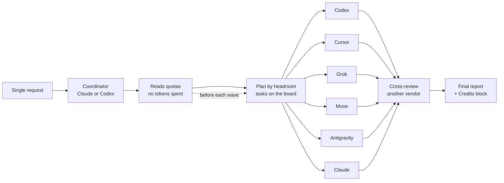
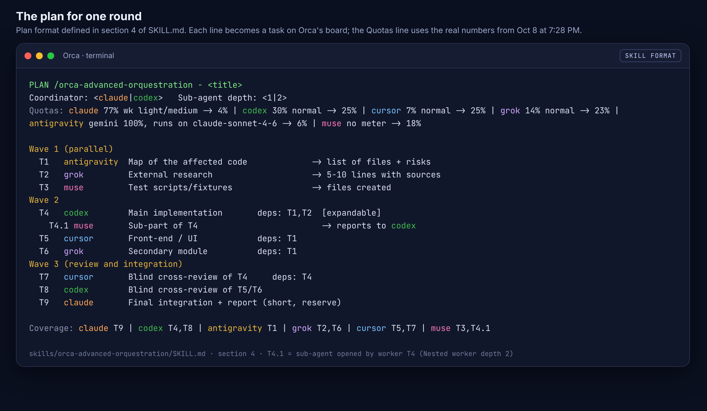
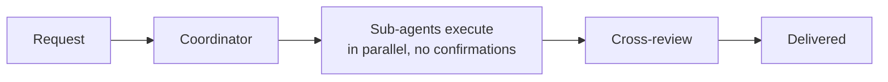
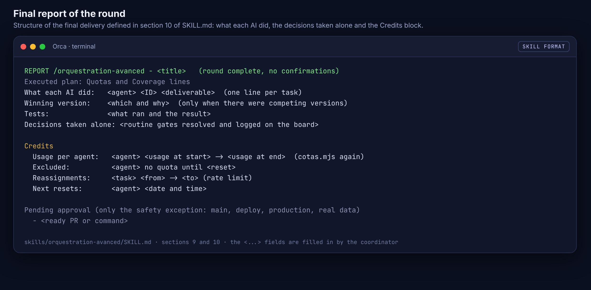

# The idea: one request, six AIs working together

This document explains the idea behind `orca-skills`: why use six AIs at the same time, how they organize themselves and why that gets more done than a single AI. To install, go straight to the [tutorial](TUTORIAL.md); for the overview, see the [README](../README.md) and the [skill itself](../skills/orquestration-avanced/SKILL.md).

## The problem

The usual way to code with AI is to open one assistant and ask it for everything, one thing after another. That has three limits:

- **A queue.** One AI does one task at a time. Research, implementation, tests and review wait in line behind each other.
- **A single quota.** Every subscription has a usage limit. When it runs out, work stops until the reset, even if you pay for other AIs that are sitting idle.
- **A single point of view.** The same AI that writes the code reviews it, and it tends not to see its own mistakes.

In practice it showed up like this: the Gemini quota ran out, Claude went past 80% of its week, and the other subscriptions (Codex, Cursor, Grok, Muse) still had plenty of unused headroom.

## The idea

Treat the subscriptions as a **team**, not as separate tools. You make a single request and the `/orquestration-avanced` skill, inside [Orca](https://github.com/stablyai/orca), splits the work across six AIs at the same time:

| AI | Plan | Main role |
|---|---|---|
| **Claude** | Max (5 h window + weekly) | Coordination, heavy implementation, integration and critical review |
| **Codex** | Pro (5 h window + weekly) | Heavy implementation and tests |
| **Cursor** | Pro Plus (monthly) | Front-end, UI, medium and heavy implementation |
| **Grok** | Weekly | Web research, critical review, medium implementation |
| **Antigravity** | Starter (weekly) | Broad code reading and a map of what will be affected |
| **Muse** | No quota meter | Tightly scoped parts, scripts and small fixes |

The pillars of the idea:

1. **Parallelism.** Up to 6 workers at the same time, each in its own git worktree. With **Nested worker depth = 2**, a worker with a big task can also open up to 2 support sub-agents.
2. **Claude and Codex as the main pair.** Heavy work goes to whichever of the two has more headroom. Cursor, Grok and Muse take real implementation parts, not just leftovers.
3. **100% autonomy.** Sub-agents execute everything on their own, with no confirmations: they obey the coordinator, never ask the user and, with Chrome unlocked, act in the browser without asking for each click. You do not need to watch anything (see [100% autonomy](#100-autonomy)).
4. **Cross-review.** One AI's work is reviewed by an AI from another vendor.
5. **Credit management.** The split follows each AI's real quota and spending pace, so none runs out before its reset.
6. **Token economy.** Short handoffs, compact rules and no re-reading of large files.
7. **Reproducible setup.** The PC's setup is the source of truth and is kept in sync with git. The installers for Windows, macOS and Linux recreate everything with one command.

## How the dynamics work




Step by step:

1. **Request.** You describe the goal once: `/orquestration-avanced <what needs to be done>`.
2. **Coordinator.** Claude or Codex takes over coordination. If Claude is above 80%, Codex takes the heavy work.
3. **Quota reading.** The coordinator runs `cotas.mjs`, which reads `orca account list --json` and spends no tokens. Out comes a `Quotas` line with usage, pace, reset and each AI's share.
4. **Plan.** The task is broken down automatically, without asking, into tasks with IDs (T1, T2, T4.1...) organized in waves. The "Coverage" line shows what each AI took: every AI with quota gets at least one task.
5. **Parallel waves.** The tasks of each wave go out together, each in its own worktree. `--deps` only holds back what depends on another delivery. Tasks marked `[expandable]` can open up to 2 sub-agents.
6. **Rebalancing.** Before each wave, quotas are read again and the split is adjusted.
7. **Cross-review.** Each delivery is reviewed by an AI from another vendor, which does not know who wrote it and points out errors instead of praising.
8. **Delivered.** The run goes from request to delivery with no stop for confirmation. The final report shows what was done, by which AI, the decisions taken and the Credits block.

### The plan, in the skill's format

This is the plan format defined in `SKILL.md`. Each line becomes a task on Orca's board, and the Quotas line uses the real numbers from Oct 8, 2026, 7:28 PM (Brasília time):



### In practice, inside Orca

A real screenshot of the Orca window, cropped to show only the structure. Each task becomes a worktree named `<agent> - <ID> <title>`, a child of the coordinator's session, and the status bar shows the quota the skill reads:


## Why it is more efficient


- **Real parallelism.** Research, implementation, tests and documentation move at the same time instead of waiting in a queue. Separate worktrees keep one AI from getting in another's way.
- **Combined quota.** The limit is no longer one subscription's, it is the sum of all of them. When one gets tight, the others absorb the work, and the subscriptions you already pay for stop sitting idle.
- **No single point of failure.** If an AI hits its limit, gets logged out or hangs, the task moves right away to the next one with headroom. The work goes on.
- **Less bias.** The reviewer comes from another vendor, trained differently. Mistakes the same AI that wrote the code would miss have a better chance of showing up.
- **Combined strengths.** Each AI does what it does best: Codex and Claude on the heavy work, Cursor on the interface, Grok on research and critique, Antigravity on broad code reading, Muse on scoped parts.
- **100% autonomy.** No sub-agent stops to wait for a confirmation, not even to click in Chrome. Work flows from request to delivery while you do something else.

> **Example (illustrative):** for a feature with front-end, back-end and tests, a single AI would do research, back-end, front-end, tests and review in sequence. In the team, Antigravity maps the code while Grok researches. Then Codex builds the back-end while Cursor builds the interface, and each reviews the other's work.

## Credit management


Credit management was born when Gemini ran out and Claude went past 80%. The rule is simple: **each AI spends at the pace of its own quota**.

- **Real and free reading.** Before the plan and before each wave, `cotas.mjs` reads each AI's quota without spending tokens. No prompt is ever sent just to check quota.
- **Thresholds by the worst window** (5 h, weekly or monthly): below 60% is normal; from 60% to 80%, only light and medium tasks; from 80%, only reviews and short tasks; from 95%, out until the reset.
- **Proportional split.** Each AI's share is proportional to `headroom × pace × plan size`.
- **Healthy pacing.** Pace is usage minus the time already elapsed in the window. Whoever is spending too fast gets less; whoever is behind with headroom gets more. The goal is that no AI runs out before its reset.
- **Reserve.** Claude and Codex keep 15% of the week for critical review and coordination.
- **More work for whoever has headroom.** Codex, Cursor, Grok and Muse with headroom take real implementation.
- **Antigravity without Gemini.** If the Gemini quota runs out but "Claude and GPT models" still has room, it runs with Claude Sonnet and takes at most one short task per wave.
- **Cheapest model that does the job.** A light task gets a smaller model or low effort; only heavy work uses the default model or high effort.
- **Rate limit mid-run.** The worker reports `NO QUOTA until <reset>` and the coordinator reassigns the task right away, without asking.
- **Extra credits do not count.** Separately paid usage is not treated as headroom.
- **Accountability.** The final report has the Credits block: each AI's usage at the start and at the end, who sat out and until when, the reassignments and the next resets.

A real reading taken on the PC on Oct 8, 2026, at 7:28 PM (Brasília time). It confirms the idea: Claude, with 77% of its week used and ahead of its pace, is in light/medium and gets only a small share; Gemini ran out, so Antigravity runs with Claude Sonnet; and Codex, with headroom, gets the heavy work while Cursor and Grok take real chunks.


## 100% autonomy

> [!IMPORTANT]
> **Sub-agents execute everything on their own, with no confirmations.** They obey the coordinator 100%, never ask the user and nothing stops the run. You make the request and get the delivery.




### Unlocked AIs

In Orca, each agent runs with the arguments that skip every confirmation:

| AI | Argument |
|---|---|
| Claude | `--dangerously-skip-permissions` |
| Codex | `--dangerously-bypass-approvals-and-sandbox` |
| Cursor | `--yolo` |
| Grok | `--permission-mode bypassPermissions` |
| Antigravity | `--dangerously-skip-permissions` |
| Muse | `--yolo` |

### The coordinator is in charge

- **Full obedience.** Sub-agents obey the coordinator 100% and execute without asking anyone for approval or confirmation.
- **They never ask the user.** You do not watch the sub-agents, so nobody stops to wait for you. Scope doubts go to the coordinator with `orca orchestration ask`; with no answer, the sub-agent picks the safest reversible option, logs it and moves on.
- **Routine gates resolved by the coordinator itself.** Architecture, refactoring, deleting code inside the worktree or creating a new migration: it decides alone, logs it on the board with `gate-create` + `gate-resolve` and moves on.

### Unlocked Chrome

The browser runs on autopilot too, without asking for each click:

- **Claude:** the **Claude in Chrome** extension is installed, turns on by itself and opens in auto mode.
- **Codex:** the `chrome`, `browser` and `computer-use` plugins are enabled in Codex's configuration.
- **Orca:** remote browser access is enabled.

With that, Claude and Codex open, read and act in your Chrome on their own: they browse, click, test pages and check the deployed interface. Visual QA, research and interface tests run with no confirmations. Today Claude and Codex are the ones with this Chrome access; the other AIs work through the terminal.

### Why it pays off

- **Nothing stops the run.** With no confirmations along the way, the waves run in parallel from start to finish.
- **You are free.** No need to watch six AIs or approve step by step.
- **Traceable decisions.** What the coordinator decides alone is logged on the board and shows up in the report under "Decisions taken alone".
- **Reversible by design.** Each sub-agent works in its own worktree and branch, so anything can be thrown away.
- **Same rules in every AI.** The installer writes the same instructions into all of them: `~/.claude/CLAUDE.md`, `~/.codex/AGENTS.md`, `~/.gemini/GEMINI.md` (Antigravity), `~/.config/muse/AGENTS.md`, `~/.grok/rules/orca-equipe.md` and `~/.cursor/rules/orca-equipe.mdc`. Any of them, coordinating or as a sub-agent, works the same way.

The final report, in the skill's format, shows what each AI did and the Credits block:



**Only exception, for safety.** The skill keeps a few fixed limits (section 9 of `SKILL.md`): merge or push to `main`, deploy, production actions, deleting or changing real data, running a migration on a real database, touching secrets and deleting files outside the worktree. In these cases the sub-agent does not stop: it leaves the PR, branch or command ready and lists it in the final report under "Pending approval". The rest of the work goes on as usual.

## Getting started

1. Follow the [full tutorial](TUTORIAL.md): Orca, CLIs, logins and the installer for your system.
2. In Orca, set **Settings > Orchestration > Nested worker depth = 2**.
3. Open a Claude or Codex session in the project and ask:

```
/orquestration-avanced <what needs to be done>
```
