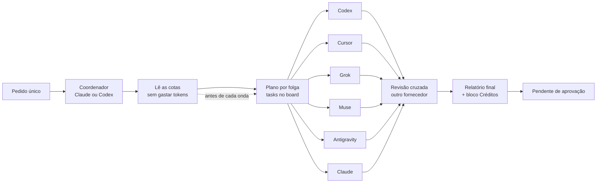
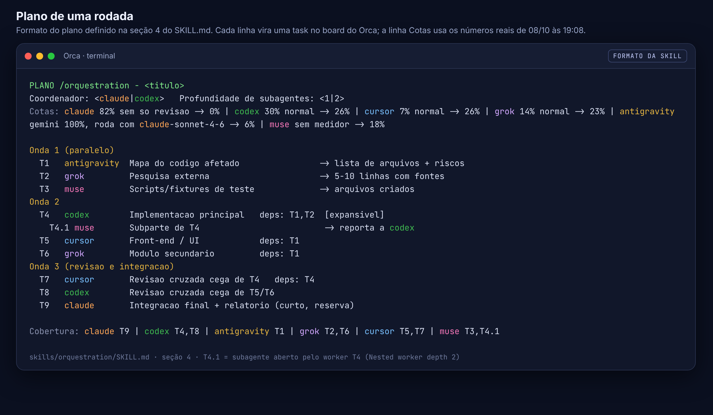
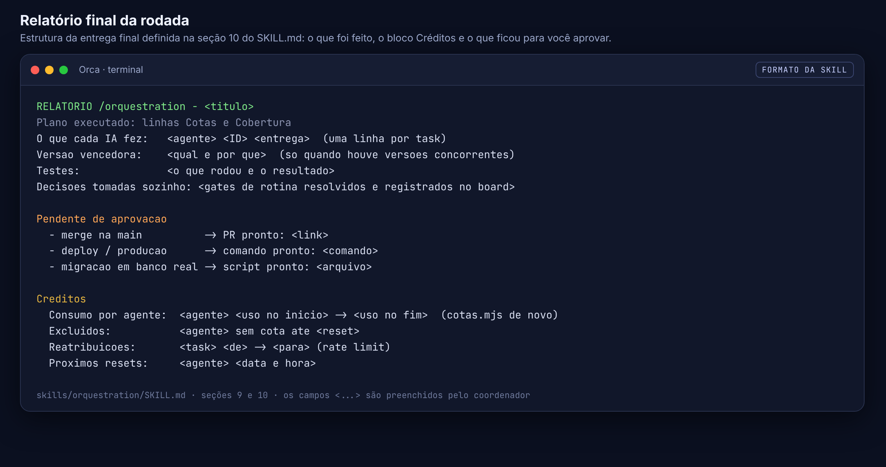

# A ideia: um pedido, seis IAs trabalhando juntas

Este documento explica a ideia por trás do `orca-skills`: por que usar seis IAs ao mesmo tempo, como elas se organizam e por que isso rende mais do que uma IA sozinha. Para instalar, vá direto ao [tutorial](TUTORIAL.md).

## O problema

O jeito comum de programar com IA é abrir um assistente e pedir tudo para ele, uma coisa depois da outra. Isso tem três limites:

- **Fila.** Uma IA faz uma tarefa por vez. Pesquisa, implementação, testes e revisão esperam uma atrás da outra.
- **Cota única.** Cada assinatura tem um limite de uso. Quando ele acaba, o trabalho para até o reset, mesmo que você pague outras IAs que estão paradas.
- **Um ponto de vista só.** A mesma IA que escreve o código é a que revisa, e tende a não enxergar os próprios erros.

Na prática isso apareceu assim: a cota do Gemini acabou, o Claude passou de 80% da semana, e as outras assinaturas (Codex, Cursor, Grok, Muse) ainda tinham bastante folga sem uso.

## A ideia

Tratar as assinaturas como uma **equipe**, não como ferramentas soltas. Você faz um único pedido e a skill `/orquestration`, dentro do [Orca](https://github.com/stablyai/orca), divide o trabalho entre seis IAs ao mesmo tempo:

| IA | Plano | Papel principal |
|---|---|---|
| **Claude** | Max (janela de 5 h + semanal) | Coordenação, implementação pesada, integração e revisão crítica |
| **Codex** | Pro (janela de 5 h + semanal) | Implementação pesada e testes |
| **Cursor** | Pro Plus (mensal) | Front-end, UI, implementação média e pesada |
| **Grok** | Semanal | Pesquisa na web, revisão crítica, implementação média |
| **Antigravity** | Starter (semanal) | Leitura ampla do código e mapa do que será afetado |
| **Muse** | Sem medidor de cota | Partes com escopo fechado, scripts e ajustes pontuais |

Os pilares da ideia:

1. **Paralelismo.** Até 6 workers ao mesmo tempo, cada um na própria git worktree. Com **Nested worker depth = 2**, um worker com tarefa grande ainda pode abrir até 2 subagentes de apoio.
2. **Claude e Codex como dupla principal.** O trabalho pesado fica com quem dos dois tiver mais folga. Cursor, Grok e Muse pegam partes reais de implementação, não só sobras.
3. **Autonomia total com limites fixos.** Você não precisa acompanhar os subagentes: todos rodam sem pedir aprovação e obedecem ao coordenador. O que é arriscado fica pronto e vai para "Pendente de aprovação".
4. **Revisão cruzada.** O trabalho de uma IA é revisado por uma IA de outro fornecedor.
5. **Gestão de créditos.** A divisão segue a cota real de cada IA e o ritmo de gasto, para nenhuma esgotar antes do reset.
6. **Economia de tokens.** Handoffs curtos, regras compactas e nada de reler arquivos grandes.
7. **Configuração reproduzível.** A configuração do PC é a fonte da verdade e fica sincronizada no git. Os instaladores para Windows, macOS e Linux recriam tudo com um comando.

## Como funciona a dinâmica




Passo a passo:

1. **Pedido.** Você descreve o objetivo uma vez: `/orquestration <o que precisa ser feito>`.
2. **Coordenador.** Claude ou Codex assume a coordenação. Se o Claude estiver acima de 80%, o Codex assume o trabalho pesado.
3. **Leitura de cotas.** O coordenador roda `cotas.mjs`, que lê `orca account list --json` e não gasta nenhum token. Sai uma linha `Cotas` com uso, ritmo, reset e a parte de cada IA.
4. **Plano.** A tarefa é quebrada sozinha, sem perguntar, em tasks com IDs (T1, T2, T4.1...) organizadas em ondas. A linha "Cobertura" mostra o que cada IA pegou: toda IA com cota recebe pelo menos uma task.
5. **Ondas em paralelo.** As tasks de cada onda saem juntas, cada uma na sua worktree. `--deps` segura só o que depende de outra entrega. Tasks marcadas `[expansivel]` podem abrir até 2 subagentes.
6. **Rebalanceamento.** Antes de cada onda, as cotas são lidas de novo e a divisão é ajustada.
7. **Revisão cruzada.** Cada entrega é revisada por uma IA de outro fornecedor, que não sabe quem fez e aponta erros em vez de elogiar.
8. **Relatório.** No fim vem o que foi feito, por qual IA, as decisões tomadas, o bloco Créditos e a lista "Pendente de aprovação".

### O plano, no formato da skill

Este é o formato do plano definido no `SKILL.md`. Cada linha vira uma task no board do Orca, e a linha Cotas usa os números reais de 08/10, às 19:08:



### Na prática, dentro do Orca

Print real da janela do Orca, recortado para mostrar só a estrutura. Cada task vira uma worktree com o nome `<agente> - <ID> <título>`, filha da sessão do coordenador, e a barra de status mostra a cota que a skill lê:


## Por que é mais eficiente


- **Paralelismo real.** Pesquisa, implementação, testes e documentação andam ao mesmo tempo, em vez de esperar numa fila. As worktrees separadas evitam que uma IA atrapalhe o trabalho da outra.
- **Cota somada.** O limite deixa de ser o de uma assinatura e passa a ser a soma de todas. Quando uma aperta, as outras absorvem o trabalho, e as assinaturas que você já paga deixam de ficar ociosas.
- **Sem ponto único de falha.** Se uma IA bate o limite, cai o login ou trava, a tarefa passa na hora para a próxima com folga. O trabalho continua.
- **Menos viés.** Quem revisa é de outro fornecedor, treinado de outro jeito. Erros que passariam despercebidos pela mesma IA que escreveu têm mais chance de aparecer.
- **Forças combinadas.** Cada IA faz o que faz melhor: Codex e Claude no pesado, Cursor na interface, Grok na pesquisa e na crítica, Antigravity na leitura ampla do código, Muse nas partes fechadas.
- **Autonomia.** Ninguém para esperando você aprovar passo de rotina. Você só decide o que realmente importa: merge, deploy, produção e dados reais.

> **Exemplo (ilustrativo):** numa feature com front-end, back-end e testes, uma IA sozinha faria pesquisa, back-end, front-end, testes e revisão em sequência. Na equipe, o Antigravity mapeia o código e o Grok pesquisa ao mesmo tempo. Depois o Codex faz o back-end enquanto o Cursor faz a interface, e cada um revisa o trabalho do outro.

## Gestão de créditos


A gestão de créditos nasceu hoje, quando o Gemini esgotou e o Claude passou de 80%. A regra é simples: **cada IA gasta no ritmo da própria cota**.

- **Leitura real e grátis.** Antes do plano e antes de cada onda, `cotas.mjs` lê a cota de cada IA sem gastar tokens. Nunca se manda um prompt só para checar cota.
- **Limiares pela pior janela** (5 h, semanal ou mensal): abaixo de 60% é normal; de 60% a 80%, só tarefas leves e médias; a partir de 80%, só revisão e tarefas curtas; a partir de 95%, fica de fora até o reset.
- **Divisão proporcional.** A parte de cada IA é proporcional a `folga × ritmo × tamanho do plano`.
- **Ritmo saudável.** Ritmo é o uso menos o tempo já decorrido da janela. Quem está gastando rápido demais recebe menos; quem está atrasado e com folga recebe mais. A meta é nenhuma IA esgotar antes do reset.
- **Reserva.** Claude e Codex guardam 15% da semana para revisão crítica e coordenação.
- **Mais trabalho para quem tem folga.** Codex, Cursor, Grok e Muse com folga pegam implementação de verdade.
- **Antigravity sem Gemini.** Se a cota do Gemini acaba mas sobra a de "Claude and GPT models", ele roda com o Claude Sonnet e pega no máximo uma tarefa curta por onda.
- **Modelo mais barato que resolve.** Tarefa leve vai com modelo menor ou esforço baixo; só o pesado usa o modelo padrão ou esforço alto.
- **Rate limit no meio do caminho.** O worker avisa `SEM COTA até <reset>` e o coordenador reatribui a tarefa na hora, sem perguntar.
- **Créditos extras não contam.** Uso pago à parte não é tratado como folga.
- **Prestação de contas.** O relatório final traz o bloco Créditos: consumo de cada IA no início e no fim, quem ficou de fora e até quando, as reatribuições e os próximos resets.

Leitura real feita no PC em 08/10, às 19:08. Repare que ela confirma a ideia: o Claude, com 82% da semana usados, só revisa; o Gemini esgotou, então o Antigravity roda com o Claude Sonnet; e o Codex, com folga, fica com o trabalho pesado.


## Segurança

Autonomia total não significa fazer qualquer coisa. Estes limites são fixos e nenhuma IA executa, nem com ordem do coordenador:

- merge ou push na `main`;
- deploy e qualquer ação em produção;
- apagar ou alterar dados reais;
- rodar migração em banco real;
- mexer em segredos ou credenciais;
- apagar arquivos fora da própria worktree.

Quando o trabalho chega num desses pontos, a IA deixa tudo pronto (branch, PR ou comando) e lista em **"Pendente de aprovação"** no relatório. O resto continua andando. Os gates de rotina (arquitetura, refatoração, migração nova no código) o coordenador decide sozinho e registra no board.

O relatório final, no formato da skill, junta tudo isso: o que cada IA fez, o que ficou para você aprovar e o bloco Créditos.



## Como começar

1. Siga o [tutorial completo](TUTORIAL.md): Orca, CLIs, logins e o instalador do seu sistema.
2. No Orca, coloque **Settings > Orchestration > Nested worker depth = 2**.
3. Abra uma sessão do Claude ou do Codex no projeto e peça:

```
/orquestration <o que precisa ser feito>
```
